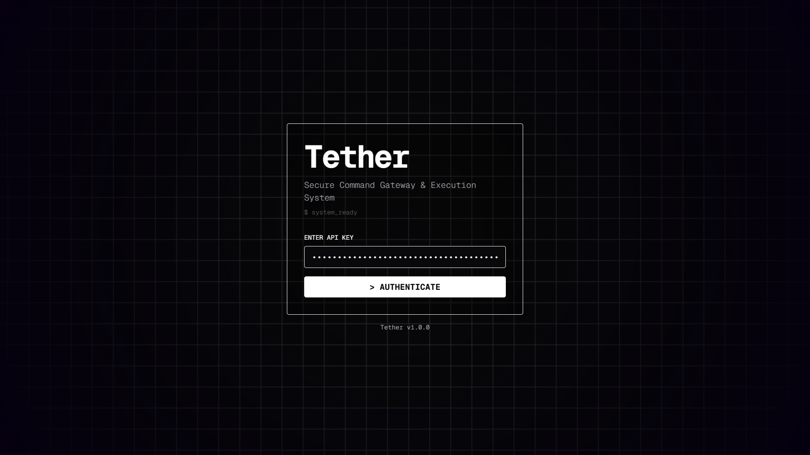
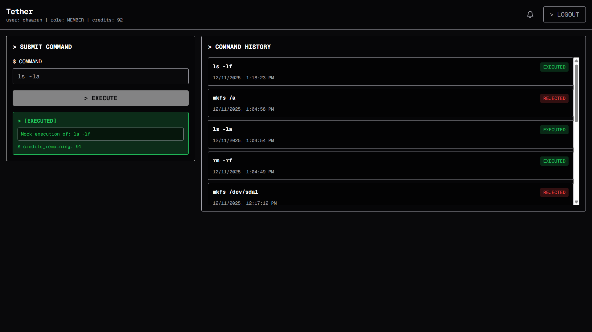
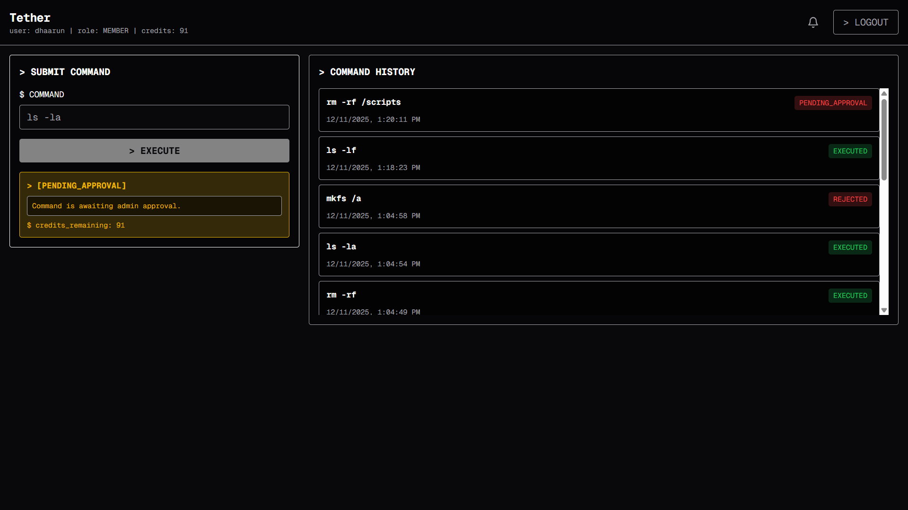
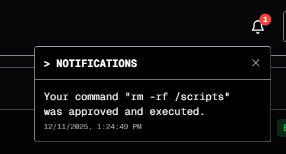
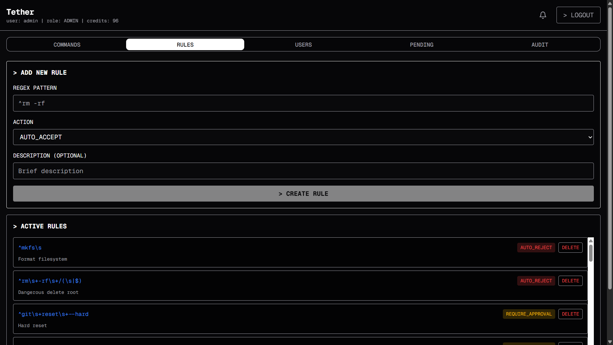
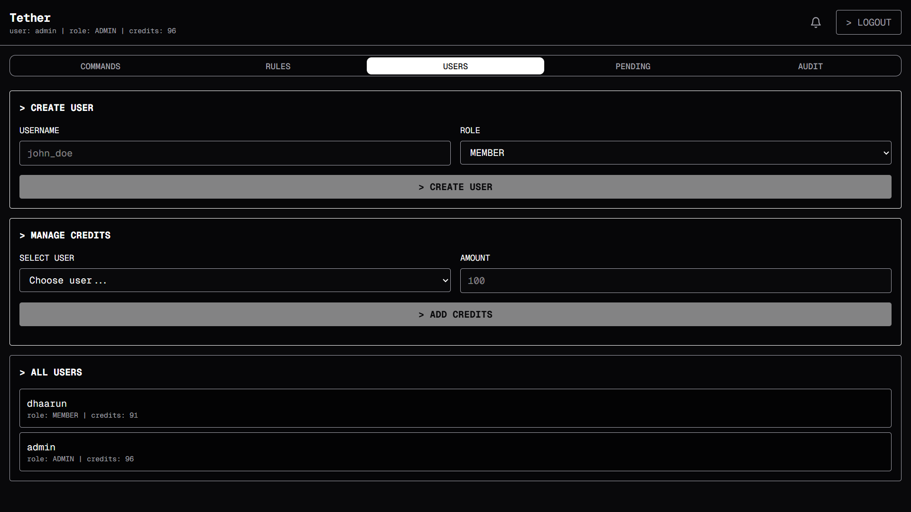
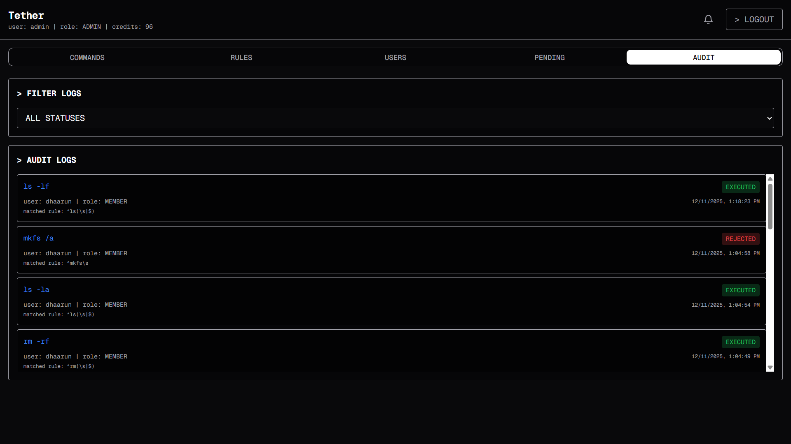
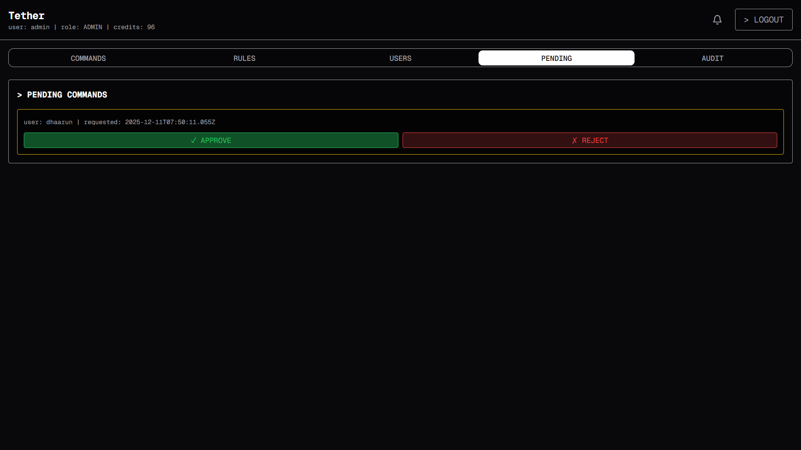

# Tether
> Secure Command Gateway & Execution System

**Tether** is a robust, terminal-styled command execution gateway designed to bridge the gap between users and sensitive system operations. It provides a secure, monitored environment where commands are filtered through a regex-based rule engine, requiring authentication, credit consumption, and administrative approval for high-risk actions.

Built with a retro-futuristic aesthetic, Tether ensures that system interaction is both seamless for users and strictly controlled for administrators.

## Features

### Core Functionality
- **Terminal Interface:** A fully immersive, keyboard-first UI with retro aesthetics.
- **Command History:** Persistent logging of executed commands and their outputs.
- **Real-time Notifications:** Asynchronous alerts for command approvals and system messages.
- **Credit System:** Resource management system limiting command execution based on user credits.

### Admin Capabilities
- **Rule Engine:** Define regex patterns to `AUTO_ACCEPT`, `AUTO_REJECT`, or `REQUIRE_APPROVAL` for specific commands.
- **Audit Logs:** Comprehensive searchable logs of all user activities and command statuses.
- **User Management:** Create users, assign roles (Admin/Member), and manage API keys.
- **Approval Queue:** Review and adjudicate commands flagged for manual intervention.

## Interface

### User Dashboard
#### login screen

#### command panel

#### command awaiting approval

#### notifications

<!-- Add screenshot of User Dashboard here showing Command Input and History -->

### Admin Dashboard
#### rules tab

#### adding users

#### logs

#### approve/reject command

<!-- Add screenshot of Admin Dashboard here showing Rules, Users, and Audit Logs -->

## Tech Stack

- **Framework:** [Next.js 15](https://nextjs.org/) (App Router)
- **Language:** TypeScript
- **Styling:** Tailwind CSS
- **UI Components:** Shadcn UI, Radix Primitives
- **Icons:** Lucide React
- **Animations:** GSAP (GreenSock)
- **Backend Integration:** REST API